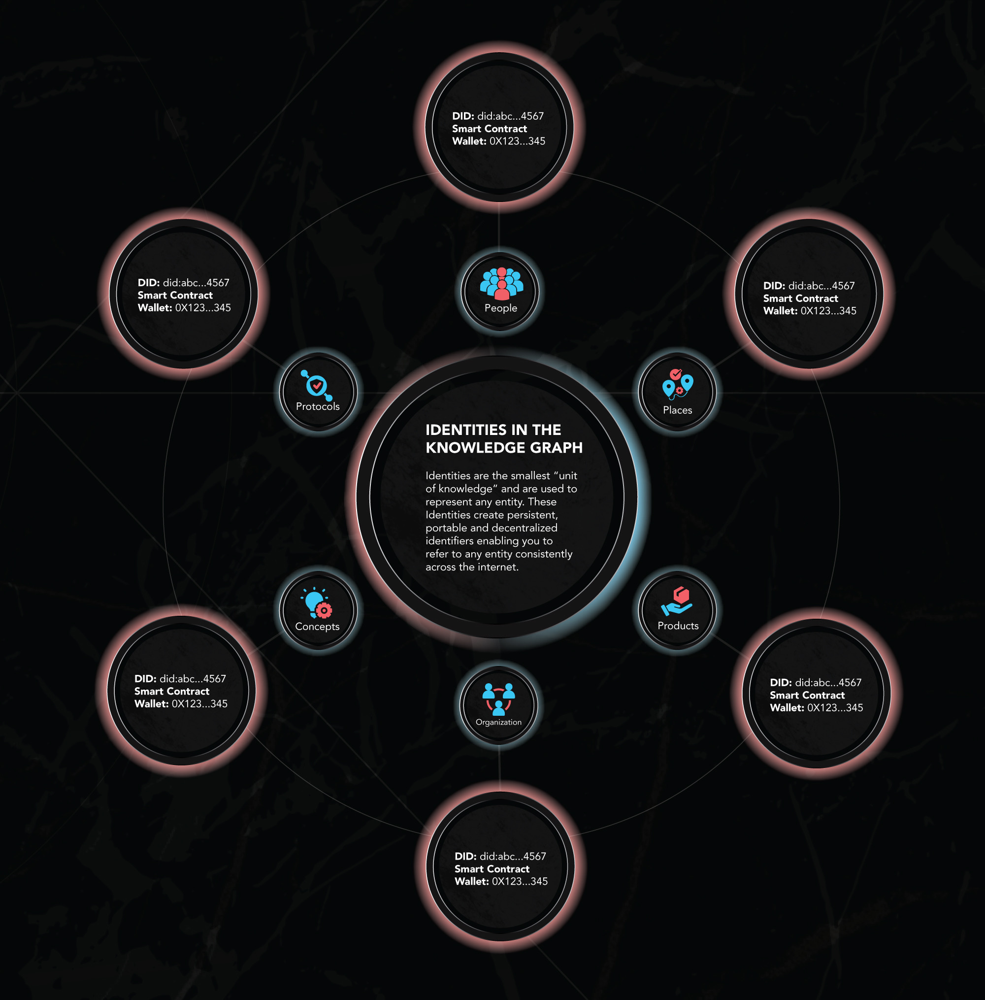

# 👋 Introduction


**NOTE: Preparing for Mainnet Launch**

As we gear up for our mainnet launch, please be aware that our documentation is currently a work-in-progress. Our team is fully committed to ensuring a smooth transition to production, which means updates to our docs might not keep pace with the latest developments. We encourage you to check back frequently for the most current information and updates. Your understanding and patience during this exciting time are greatly appreciated.


### Who We Are

Intuition is an Ethereum-based attestation protocol harnessing the wisdom of the crowds to create an open knowledge and reputation graph. Our infrastructure makes it easy for applications and their users to capture, explore, and curate verifiable data. We’ve prioritized making developer integrations easy and have implemented incentive structures that prioritize ‘useful’ data and discourage spam.

In bringing this new data layer to the decentralized web, we’re opening the flood gates to countless new use cases that we believe will kick off a consumer application boom.

The Intuition Knowledge Graph will be recognized as an organic flywheel, where the more developers that implement it, the more valuable the data it houses becomes.

### What Can You Do With It?

The Intuition Protocol differentiates itself through a novel architecture that decouples “statements” from “attestations”, allowing for many-to-one relationships between "identities" and "claims" and enabling the easy integration of game-theoretic incentive mechanics. But that’s complicated and hard to understand, and we’ve abstracted away the development complexities, so instead let’s explore what you can build using Intuition:

**Universal and portable digital identity:** Imagine an internet where universal login does much more than just get you past the authentication page. A world where financial services, digital marketplaces, and publications all connect to you, and not just your email.

**Universal digital reputation:** Imagine your hard work, ideas, and clout being at your fingertips regardless of the application or website you're on. Contractors, renters, buyers, sellers, customers, writers, you name it…can easily move amongst communities without needing to start over.

**Universal reviews:** Imagine a world where feedback and customer experience doesn’t belong to the platform, but rather relates to the product, content, restaurant, or service being reviewed. No matter where you are on the internet, have access to the totality of experiences. Reviewers become niche celebrities unbeholden to the censorship prone web2 monoliths.

**Universal social graphs:** Imagine a world where your network and interests belong to you. A world where you own the lens which you experience the internet through. A world where at the click of a button you can see the internet curated through the lens of someone else.

While creating digital identities and making claims about those identities may, at first glance, seem to be a simple premise, the implications are actually so large that we can only imagine a portion of the use cases and we need your help to unlock the rest. If you understand how important this is, then please come build with us by getting in touch: build@intuition.system


#### Examples To Build

**Web3 Wallets** Real time web3 and smart contract reputation integrations - is this contract or EOA safe to interact with?

**Browser Plugins** Bring omni-reputation to the internet - is this twitter user a subject matter expert?

**Curation of Things** What services or products are recommended by trusted sources

**Community Formation** Gate or organize communities by demonstrable criteria - joinable by users of a certain attestation score

**Reputation of Identities** Deeper insights into an individual or trackable information about things

**Social Media Abstraction** Instant claim creation when a user interacts with an emote 👍


### The Intuition Difference

Before Intuition, working with large verifiable data sets was hard.

We make it easy.

If you are a developer looking to integrate with the attestation stack, look no further.


#### Key Features

**Many-to-one Attestations** Novel data structure that's easy to work with, unlocking new use cases

**Advanced Querying**

Flexible and efficient data retrieval for non-trivial use cases

**Pre-bootstrapped Database** Hook into an established data lake to import rich data about all things

**Incentivized** Parameters to encourage good behavior, good data, and scale the ecosystem

**Flexible** Tooling that makes it easy to use attestations for a variety of use cases


### Additional Resources

#### Recent Media & Appearances






